I was inspired to add a social icon links to my website after seeing it on a few other developer portfolios. There was just a nice clean feel to it. 😊 It's pretty straight forward but there are a few gotchas. I will walk through how I added social icons to my website and how I worked through the issues I hit along the way.

Before:
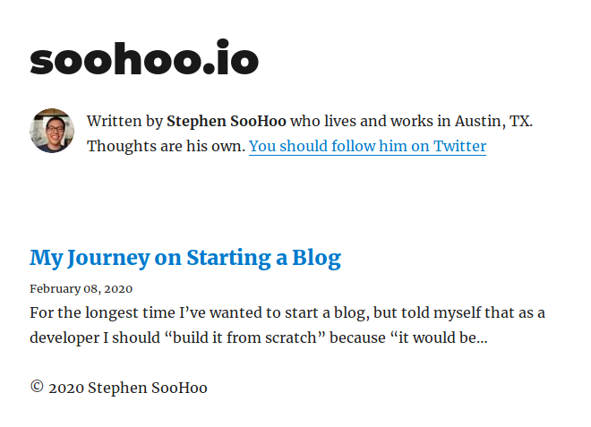

After:
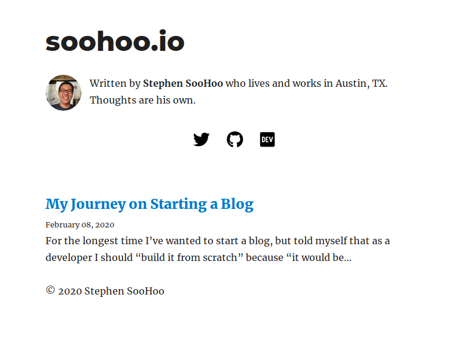

Steps:
0. Setup
1. Adding a row of links
2. Centering the links
3. Converting the text links to icon links
4. Formatting the icon links
5. Fixing icon link accessibility
6. Fixing icon link resize issues

<h2 id="setup">0. Setup</h2>

To add the icon links I will be modifying the bio component at `{project_root}/src/components/bio.js`. JSX only allows for a single parent tag to be returned so we're going to need to create a parent container to house the existing content and allow the creation of a new row.

### Code
```html
<!-- new top-level tag with column formatting -->
<div
  style={{
    display: `flex`,
    flexDirection: `column`,
    marginBottom: rhythm(2.5),
  }}
>
  <!-- previous top-level tag -->
  <div
    style={{
      display: `flex`,
      marginBottom: rhythm(2.5),
    }}
  >
    Existing content...
  </div>
  <!-- new content goes here -->
</div>
```

<h2 id="adding-a-row-links">1. Adding a row of links</h2>

Start small. Just get it on the screen and get it working.

I will have icon links for twitter, github, and dev. The gatsby blog starter already includes a config item for twitter so I'll just need to add entries for github and dev in the gatsby-config located at `{project_root}/gatsby-config.js`.

### gatsby-config.js
```javascript
module.exports = {
  siteMetadata: {
    title: `soohoo.io`,
    author: `Stephen SooHoo`,
    description: `A starter blog demonstrating what Gatsby can do.`,
    siteUrl: `https://gatsby-starter-blog-demo.netlify.com/`,
    social: {
      twitter: `soohoowoohoo`,
      github: `soohoowoohoo`,
      dev: `soohoowoohoo`,
    },
  },
  ...
}
```

### bio.js
```html
<!-- new content goes here -->
<div>
  <a href={`https://twitter.com/${social.twitter}`}>Twitter</a>
  <a href={`https://github.com/${social.github}`}>GitHub</a>
  <a href={`https://dev.to/${social.dev}`}>DEV</a>
</div>
```

### Result
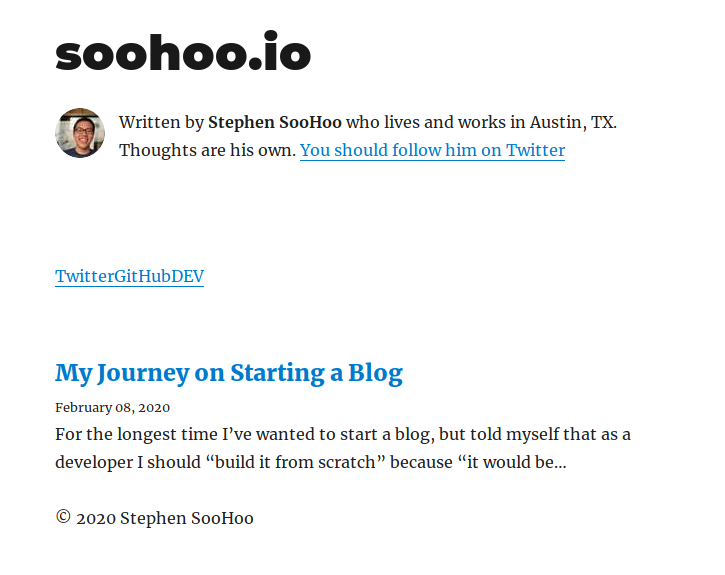
Its not pretty but it works. We'll get there...

<h2 id="centering-the-links">2. Centering the links</h2>

One thing to note is that kebab case css properties are camel case in JSX. Below the `textAlign` attribute is used to reference the `text-align` css property.

### bio.js
```html
<!-- new content goes here -->
<div style={{ textAlign: `center` }}>
  <a href={`https://twitter.com/${social.twitter}`}>Twitter</a>
  <a href={`https://github.com/${social.github}`}>GitHub</a>
  <a href={`https://dev.to/${social.dev}`}>DEV</a>
</div>
```

### Result
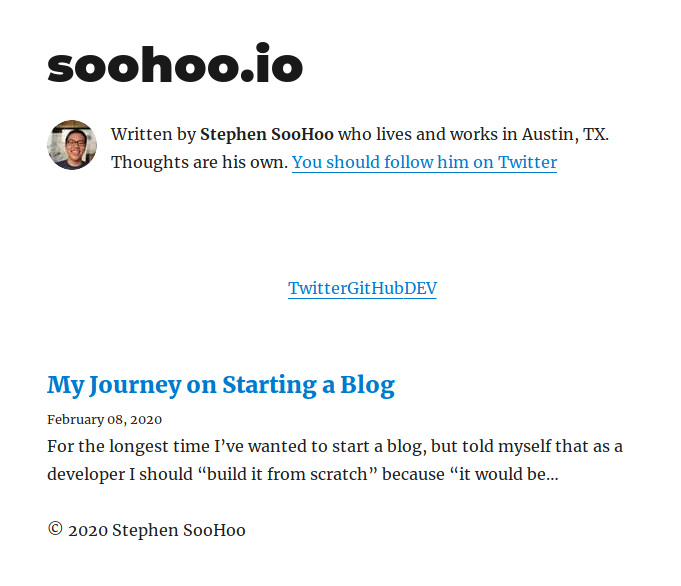

<h2 id="converting-the-text-links-to-icon-links">3. Converting the text links to icon links</h2>

Can't remember how I learned about the font-awesome icon set but I'm using it. It was straight forward to setup following their [installation](https://github.com/FortAwesome/react-fontawesome#installation) and [usage](https://github.com/FortAwesome/react-fontawesome#usage) instructions on GitHub.

### Package Install
```bash
$ npm install --save @fortawesome/react-fontawesome
$ npm install --save @fortawesome/free-brands-svg-icons
```

### bio.js
```javascript
// package imports at the top
import { FontAwesomeIcon } from '@fortawesome/react-fontawesome'
import { faDev, faGithub, faTwitter } from '@fortawesome/free-brands-svg-icons'
```
```html
<!-- new content goes here -->
<div style={{ textAlign: `center` }}>
  <a href={`https://twitter.com/${social.twitter}`} >
    <FontAwesomeIcon icon={faTwitter}/>
  </a>
  <a href={`https://github.com/${social.github}`}>
    <FontAwesomeIcon icon={faGithub}/>
  </a>
  <a href={`https://dev.to/${social.dev}`}>
    <FontAwesomeIcon icon={faDev}/>
  </a>
</div>
```

### Result
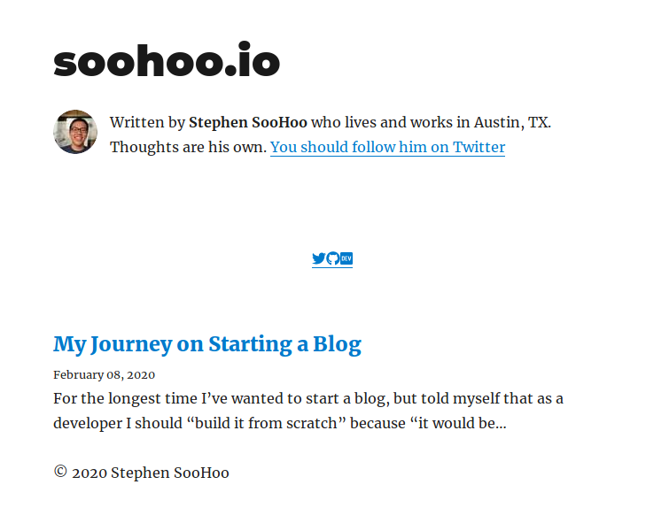
We're done, right? They're icon links. 😅

<h2 id="formatting-the-icon-links">4. Formatting the icon links</h2>

The typical icon link is not underlined and is not the default hyperlink blue. Increasing the font size, fixing the spacing, and changing the icon color wasn't bad. However, removing the underline was more difficult. [Google/stack overflow](https://stackoverflow.com/questions/10853881/how-to-remove-underline-from-a-link-in-html/10853938) gave me the following answer but no luck.

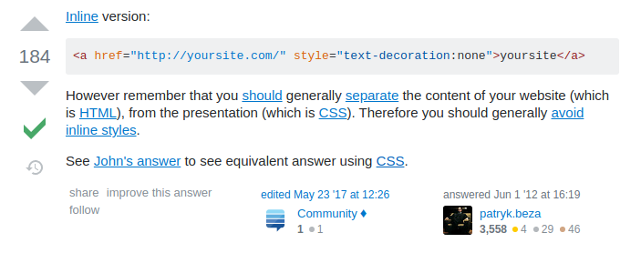

After spending enough time on google, I dug into the developer tools and inspecting the icon link element to figure out which css property was giving me the underline.

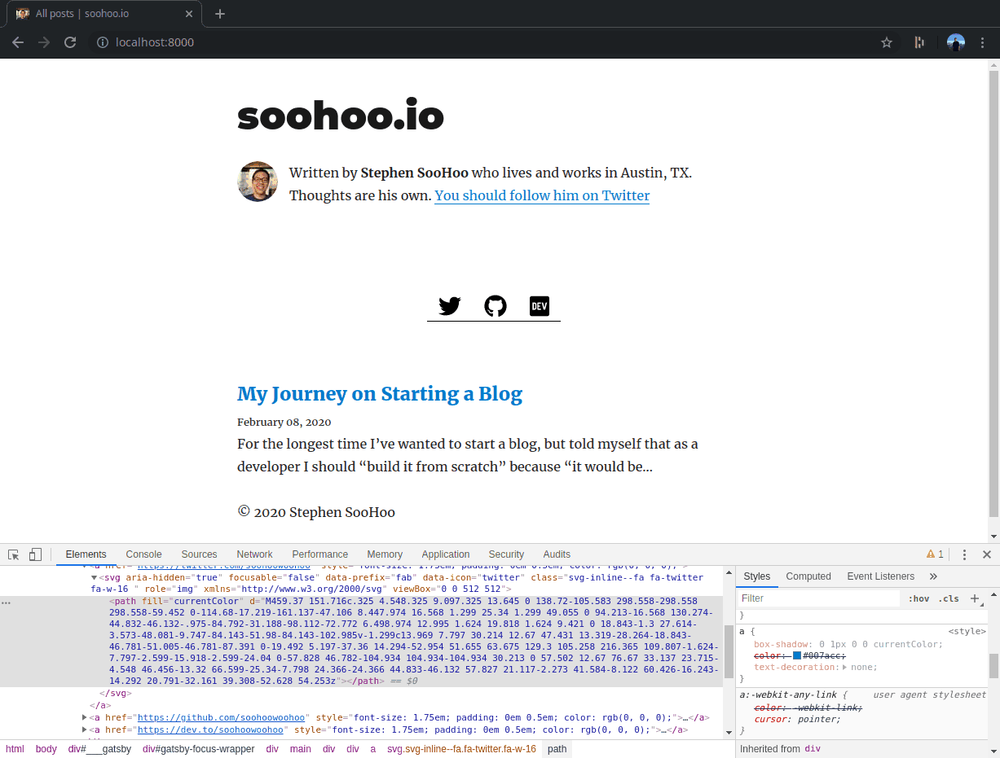

Turns out it was the `box-shadow` property. I was not able to find much on why this is the reason, but it works now.

### bio.js
```html
<!-- new content goes here -->
<div style={{ textAlign: `center` }}>
  <a
    style={{
      fontSize: `1.75em`,
      padding: `0em 0.5em`,
      color: `#000`,
      boxShadow: `none`,
    }}
    href={`https://twitter.com/${social.twitter}`}
  >
    <FontAwesomeIcon icon={faTwitter}/>
  </a>
  <a
    style={{
      fontSize: `1.75em`,
      padding: `0em 0.5em`,
      color: `#000`,
      boxShadow: `none`,
    }}
    href={`https://github.com/${social.github}`}
  >
    <FontAwesomeIcon icon={faGithub}/>
  </a>
  <a
    style={{
      fontSize: `1.75em`,
      padding: `0em 0.5em`,
      color: `#000`,
      boxShadow: `none`,
    }}
    href={`https://dev.to/${social.dev}`}
  >
    <FontAwesomeIcon icon={faDev}/>
  </a>
</div>
```

### Result
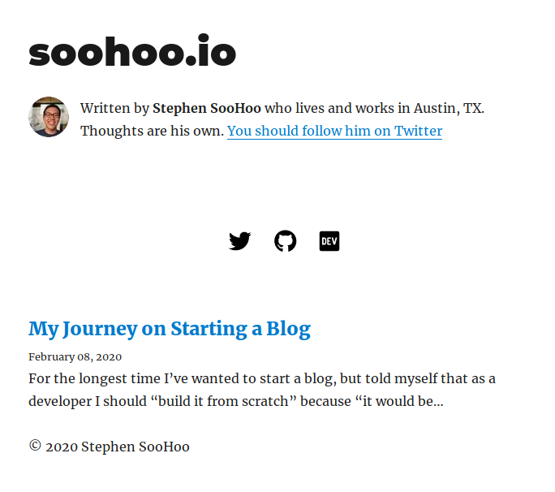

You can [dry up](https://en.wikipedia.org/wiki/Don%27t_repeat_yourself) the css by using css modules. There is a good tutorial on component scoped css provided by [gatsbyjs](https://www.gatsbyjs.org/tutorial/part-two/#using-component-scoped-css).

<h2 id="fixing-icon-link-accessibility">5. Fixing icon link accessibility</h2>

Running a Lighthouse audit shows that the new icon links added aren't fully accessible.

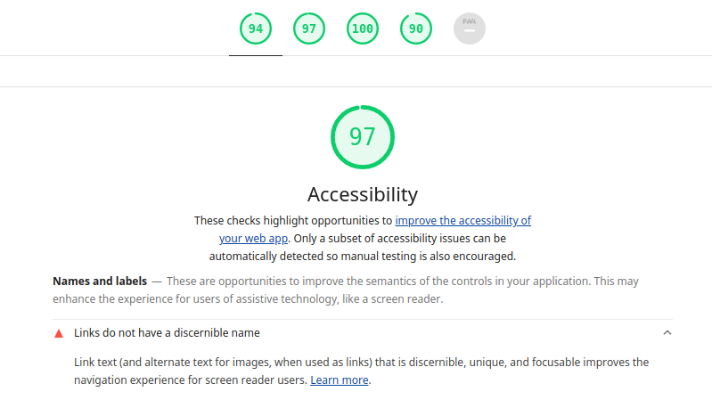

What isn't stated in the font-awesome usage documentation is that you can add the `title` property to the font-awesome icon react component to make your icon more accessible.

### bio.js
```html
<!-- new content goes here -->
<div style={{ textAlign: `center` }}>
  <a
    style={{
      fontSize: `1.75em`,
      padding: `0em 0.5em`,
      color: `#000`,
      boxShadow: `none`,
    }}
    href={`https://twitter.com/${social.twitter}`}
  >
    <FontAwesomeIcon icon={faTwitter} title='Twitter'/>
  </a>
  <a
    style={{
      fontSize: `1.75em`,
      padding: `0em 0.5em`,
      color: `#000`,
      boxShadow: `none`,
    }}
    href={`https://github.com/${social.github}`}
  >
    <FontAwesomeIcon icon={faGithub} title='GitHub'/>
  </a>
  <a
    style={{
      fontSize: `1.75em`,
      padding: `0em 0.5em`,
      color: `#000`,
      boxShadow: `none`,
    }}
    href={`https://dev.to/${social.dev}`}
  >
    <FontAwesomeIcon icon={faDev} title='DEV'/>
  </a>
</div>
```

### Result
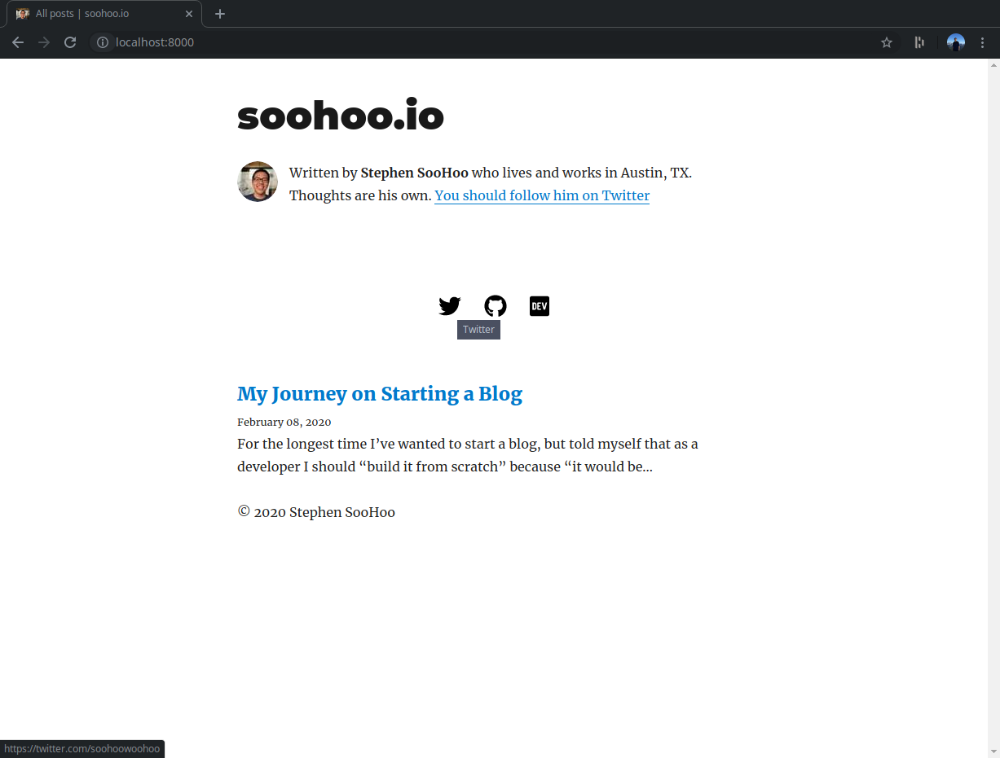

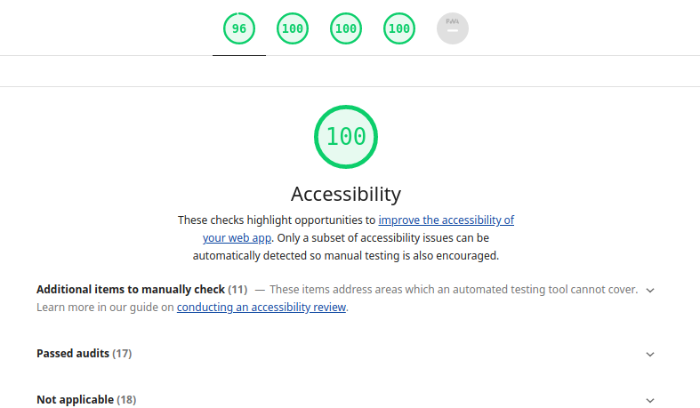

<h2 id="fixing-icon-link-resize-issues">6. Fixing icon link resize issues</h2>

This issue only showed up after deploying the icon links to my site. Everything was fine during local development.

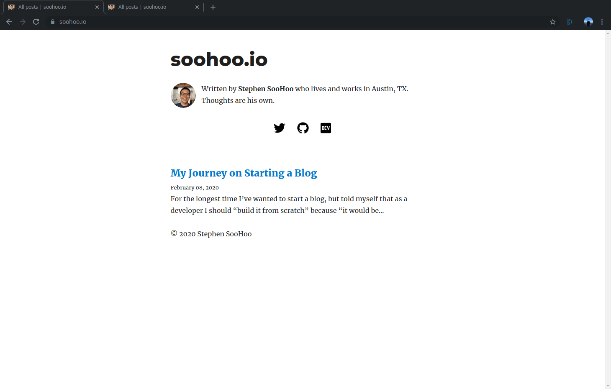

The reason for this is that the icon loads before the font-awesome css is loaded. The solution is to load the font-awesome css before react loads and to disable font-awesome from loading it's css again. I learned this with help from [this article by Markos](https://markoskon.com/notes/fix-oversized-icons-from-react-fontawesome/). He explains the problem and shows the solution in a clear and concice way.

## Inspiration
Here are a few developer portfolios that inspired me to add the social icon links.

Ali's Portfolio: https://www.alispit.tel/
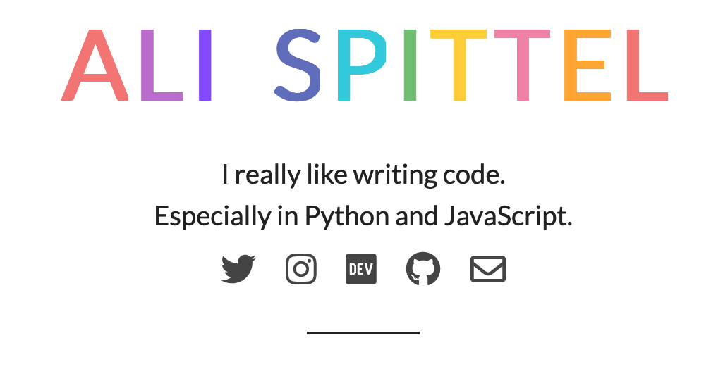

Sean's Portfolio: https://sean.is/


Jane's Portfolio: https://wongmjane.com/

