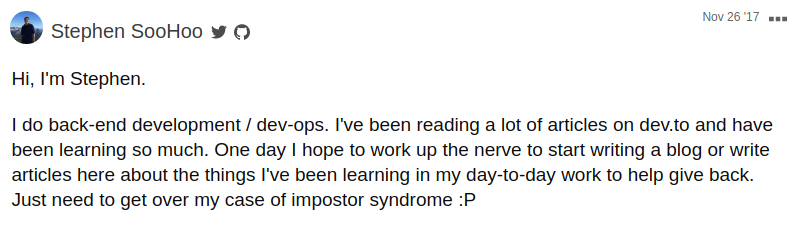

For the longest time I've wanted to start a blog, but told myself that as a developer I should "build it from scratch" because "it would be a learning experience" and "it would look better if I did". Two and half years later, I still don't have a blog. 😅

It's true that building it from scratch would have been a good learning experience, but the part that has held me back was "it would look better if I did" -- imposter syndrome at its finest. Thinking more about this has made me realize my initial desire to start a blog was to show what I know, but what held me back was the nagging thought of being called out for saying saying the wrong thing, looking like I don't know what I'm doing, or "its already been covered".

Over time I have forgotten some things I've learned along the way. The small things can be easily googled again, but the bigger things not so much. As developers we write documentation and comment our code to share how things work and why we did what we did. We take the time to remember why we do things, so why not take the time to remember how we did it and what we learned along the way.

I've chosen to start this blog first and foremost for myself and for the reasons below. I want to thank Ali, Emma, and Kelly of the [ladybug podcast](https://www.ladybug.dev) that have inspired me to do so. I also want to shout out to Saron from the [Command Line Heroes podcast](https://www.redhat.com/en/command-line-heroes) -- this dark matter developer[^1] is ready to be found. 👨‍🚀

### Writing to remember 💡
- Stop re-googling; make a list of frequently used shortcuts
- Faster relearning from the best teacher, yourself!

### Writing to share 👋
- share my story; everyone has a unique perspective
- share my learning; learn in public
- share the content developers I've learned from

### Writing to represent 💻
- I don't see enough representation by asians in the tech community, especially asian males. Is this just my perception? Right now I can only think of [Henry Zhu](https://www.henryzoo.com) from [babeljs](https://babeljs.io/). Feel free to chat with me about this on [twitter](https://twitter.com/soohoowoohoo).

[^1]: A dark matter developer is a developer who does not show up to your meetups, who does not participate in GitHub online communities, does not contribute to Stack Overflow. They are developers who are still actively working and contributing, but we do not know. We know that they're there, but we cannot see them. (Found and taken from [this Command Line Heroes podcast @ 25:10](https://www.redhat.com/en/command-line-heroes/season-2/developer-advocacy-roundtable).
